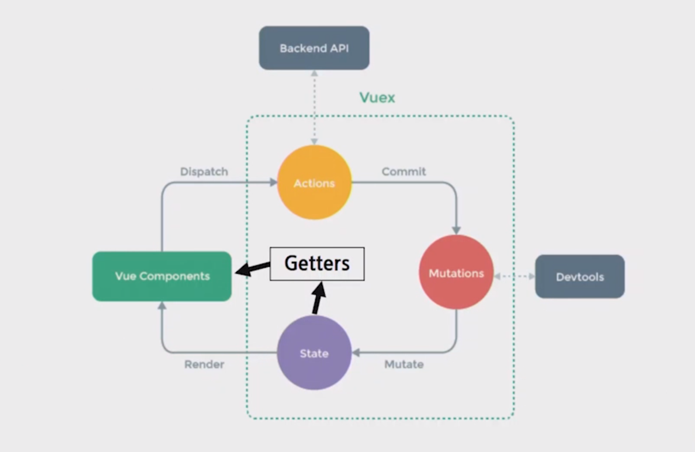
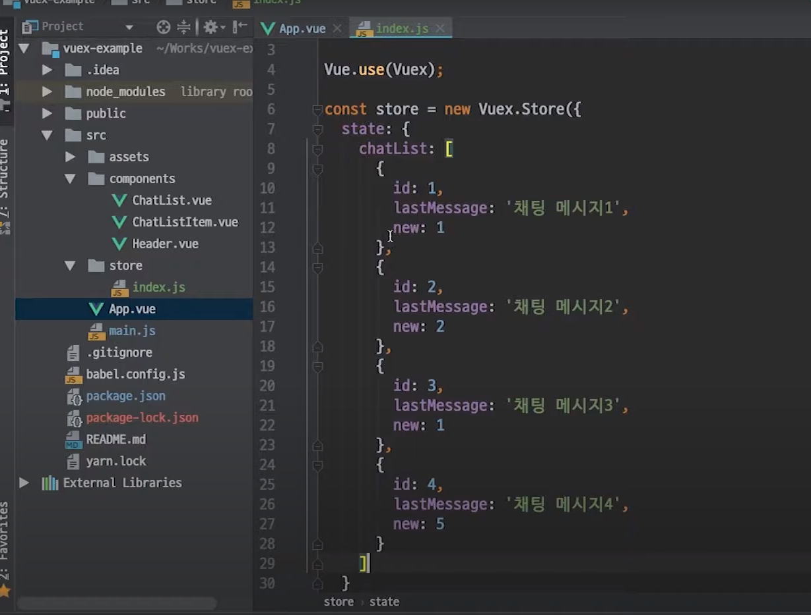
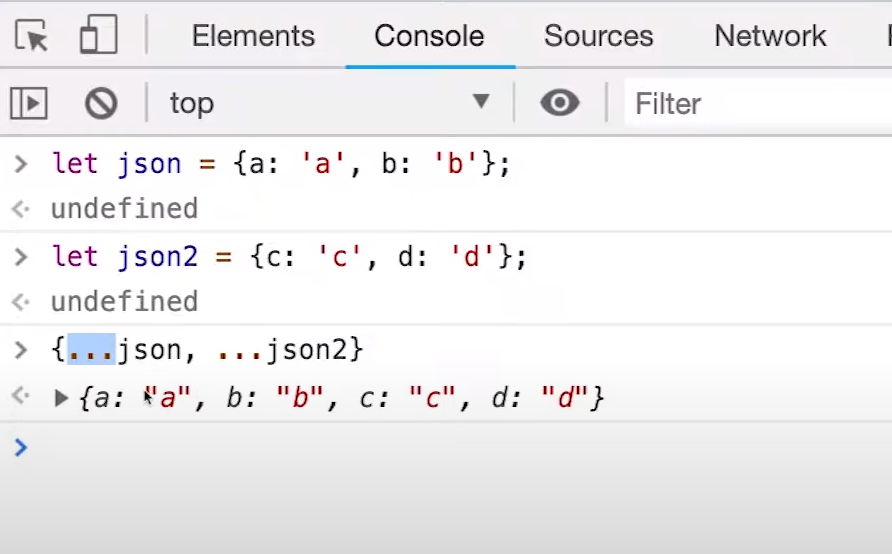
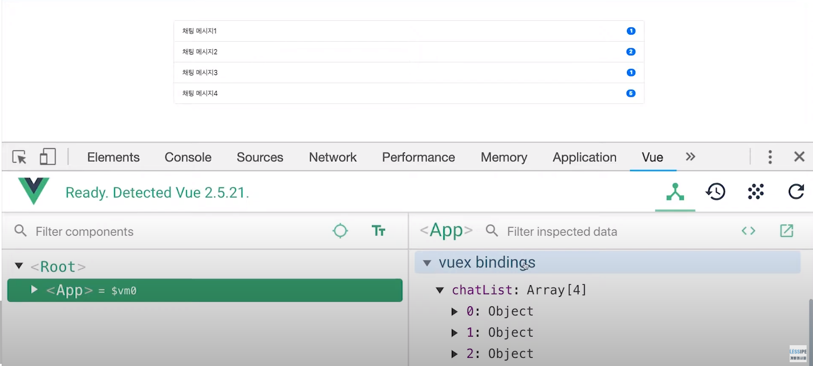

# Vue & Vuex 

>  일주일동안 전공자분들이 너무 친절하게 잘 알려 주셨지만 vue가 기억이 하나도 안나서 고생을 많이 했습니다..😭😭
>
>  진짜 도망가고 싶었지만 좋은 조를 만나서 참 다행입니다.🙂
>
>  간단하게 Vue 와 java-spring boot 를 잘 정리해 보도록 하겠습니다.
>
>  자료 출처 :[vuex cheat shee](https://vuejs-tips.github.io/vuex-cheatsheet/), [vuex](https://www.youtube.com/watch?v=Y5-pkaCFqw0&feature=youtu.be)
>
>  


# Vue 

## 1. Vuex cheat sheet 

- entry.js 

  ```javascript
  import Vue from 'vue'
  import Vuex from 'vuex'
  import stroe from './store'
  
  Vue.use(Vuex)
  
  new Vue({
      el: '#app',
      store
  })
  ```

  

- store.js

  

  - strict : true, 
  - plugins: [],
  - modules : {}, 
  - state : {}, 
    - (중앙에서 관리하는) 모든 테이터(==상태)
    - data 
  - getters: {}, 
    - 저장소의 상태를 기준으로 계산해야 하는 값 
    - 실제 상태(data)를 변경하지 않는다.
    - computed와 유사하다.
  - mutation: {},
    - state를 변경하는 로직
    - 동기적인 작업
    - 첫 번째 인자로 항상 state를 받고 commit을 통해 호출한다. 
  - actions: {},
    - state를 직접 변경하지 않고 mutations에 정의된 메서드를 호출해서 변경한다.
    - 데이터 fetch 및 처리 & 가공, 비동기 작업
    - 첫 번째 인자로 항상 context를 받고 dispatch로 
  - namespaced: false

- import map
  - mapState()
  - mapGetters()
  - mapMutations()
  - mapActions()
- Instance 
  - state 
  - getters 
  - commit()
  - dispatch()
- Pluhin Dev 
  - replaceState()
  - watch()
  - subscribe()
  - registerModule()
  - unregisterModule()
  - hotUpdate()

- Context Object
  - state 
  - rootState 
  - getters 
  - rootGetters 
  - commit()
  - dispatch()


## 2. Vuex 사용법

공통으로 사용되는 정보는 `store/index.js`에 `state`영역에 둡니다. 




`vuex`에서 데이터를 가져오려면 vuex에서 제공하는 mapStateHelper를 사용하면 됩니다. 

1. `사용하려는vue파일`안에 `import {mapState} from 'vuex' ;`

2. `computed`안에 `spread연산자(...)`를 사용해서 `mapState({})`가 반영한 값을 `return`해 줍니다.

   - 이 때 `spread연산자(...`는 json이나 배열을 쉽게 합치는 것을 도와줍니다.

     

   - 이 `mapState({})`는 파라미터로 넘긴 json값을 가지고 개발자가 원하는 state 를 vuex에서 꺼내와 computed로 사용할 수 있는 json객체를 return 합니다. 


mapState로 vuex에서 data를 꺼내올 수 있는 방법은 3가지가 있습니다.


1. 

   ```javascript
   import {mapState} from 'vuex';
   ...
   
   export default{
   	name: 'app',
   	data() {
   		return {
   	
   		},
   	},
   	computed: {
   		...mapState({
               // 컴포넌트에서 변수처럼 사용할 computed명 : chatList 
               // vuex state에서 원하는 값을 꺼내올 익명함수 정의, 내부 접근 가능 
   			chatList: state => state.chatList ;
   		})
   	},
   	
   }
   ```

2. ```javascript
   import {mapState} from 'vuex';
   ...
   
   export default{
   	name: 'app',
   	data() {
   		return {
   	
   		},
   	},
   	computed: {
   		...mapState({
               // 컴포넌트에서 변수처럼 사용할 computed명 : chatList 
               // 문자열만 입력해도 같은 결과  
   			chatList: chatList ;
   		})
   	},
   	
   }
   ```

3. 만약 특정 컴포넌트에서만 필요한 기능일 경우 

   ```javascript
   import {mapState} from 'vuex';
   ...
   
   export default{
   	name: 'app',
   	data() {
   		return {
   	
   		},
   	},
   	computed: {
   		...mapState({
               //메소드로 지정
               // 가져온 state값과 내부의 데이터 값을 가지고 계산해야하는 등의 복작한 작업이 필요한 경우 
   			chatList(state) {
                   // this.데이터명 으로 가져오는거 가능 
                   return state.chatList.filter(chat=> chat.new >= 2) ;
               }
   		})
   	},
      	methods:{
           ......
       },
   	
   }
   ```


여러 컴포넌트에서 공통으로 사용한다면 vuex에 `getter`로 정의해서 사용할 수 있습니다.

- `store/index.js`

  ```javascript
  Vue.use(Vuex);
  
  const store = new Vuex.Store({
      store: {
          chatList:[
              {
                  id: 1,
              	lastMessage: '채팅메세지1',
              	new : 1
              },
              {
                  id: 2,
              	lastMessage: '채팅메세지2',
              	new : 2
              },
              {
                  id: 3,
              	lastMessage: '채팅메세지3',
              	new : 3
              },
              {
                  id: 4,
              	lastMessage: '채팅메세지4',
              	new : 4
              },
              
          ],
       getters:{
           // state : vuex의 내부 state에 접근할 수 있는 state값 
           // getters : 개발자가 만들어 놓은 다른 getter들에게 접근할 수 있는 getter
           chatList: (state, getters) => state.chatList.filter(chat => chat.new >=2)
       }
      }
  })
  ```

  - `App.vue`에서 사용 

  ```javascript
  <script>
  import {mapGetters} from 'vuex'; 
  ...
  
  export default {
  	name: 'app',
      data() {
          return {
              
          }
      },
      computed:{
          newMessageCount() {
              return this.chatList.map(item => item.new).reduce((a, b) => a + b)
          },
          ...mapGetters({
              // 컴포넌트 내부에서 사용할 이름 : chatList 
              // getter명 : 'chatList'
              chatList: 'chatList'
          })
      },
     	methods: {
          ...
      },
  }
  ```

  

☝잠깐! 

`strict: true`로 동작시키면 vuex설계대로 동작하지 않은 이벤트를 캐치해서 오류메시지를 출력해 줍니다. 

하지만 strict모드로 배포를 하게 되면 성능 이슈가 발생하게 되니 `ture`말고 `process.env.NODE_DEV !== 'production'`이런 경우에만 strict 모드를 켜도록 설정한 후 개발을 진행하게 됩니다. 

- `store/index.js`

  ```javascript
  ......
  const store = new Vuex.Store({
      //strict: true, 
      strict: process.env.NODE_DEV !== 'production
      state: {
        ......  
      },
      ......
  })
  ```

  

`action`과 `mutaion`으로 `state`값 변경하기

- `store/index.js` 

```javascript
Vue.use(Vuex);

const store = new Vuex.Store({
    store: {
        ......
    },
    getters:{
         ......
     },
    mutations: {
        // 메소드 형태로 정의
        // vuex내부 state값에 접근할 수 있는 state : state 
        // 이 mutation을 실행 시켰을 때 넘긴 값들이 들어옴 : chat
        readChat(state, chat)
    },    
    
})
```

실제 이벤트가 발생한 `itemClick`메소드에 정의

- `components/ChatListItem.vue`

```vue
<template>
	<button>
        {{ chat.lastMessage }}
    	<span>{{ chat.new }}</span>
    </button>
	
</template>

<scripts>
export default {
    props: ['chat'],
    methods: {
        itemClick() {
    		// store의 commit 메소드로 mutation을 실행시킴 
			// 실행시킬 mutation 명 : 'readChat'
    		// mutation에 넘길 데이터 : {...this.chat}
    		this.$store.commit('readChat', {...this.chat}) ;
        }
    },
}
</scripts>
```

- `store/index.js`

```javascript
Vue.use(Vuex);

const store = new Vuex.Store({
    store: {
        ......
    },
    getters:{
         ......
     },
    mutations: {
        readChat(state, chat){
            state.chatList.forEach(item => {
                if (item.id == chat.id){
                    item.new = 0 ;
                }
            }
        }
    },    
    
```


vuex구조상 `components`는 `action`을 실행하고 `action`이 `mutation`을 실행해야 합니다. 

위의 경우에는 `components`에서 바로 `mutation`을 실행했습니다. 

이런 방법은 권장되지 않습니다. 

왜냐하면 `mutation`은 무조건 동기적이어야 하기 때문입니다. 

보통내부 상태값을 변경할 경우에는 `API`호출과 같이 사용하므로 `components`내부에서 `mutation`을 직접 호출하는 일은 많지 않고 `action`에서 비동기 처리를 한 뒤 동기적으로 `mutation`을 실행시켜 줍니다.

- `store/index.js`

```javascript
Vue.use(Vuex);

const store = new Vuex.Store({
    store: {
        ......
    },
    getters:{
         ......
     },
    mutations: {
        readChat(state, chat){
            state.chatList.forEach(item => {
                if (item.id == chat.id){
                    item.new = 0 ;
                }
            }
    },
                                  
    actions:{
        // vuex state나 getter를 가져오거나, mutation을 실행하는 commit method가 있는 context가 들어옴: context
        // 실행시 넘긴 값 : chat 
        readChat(context, chat){
                
            }
   }
})
```


`mutation`은 `commit`으로 실행 시켰다면 `action`은 `dispach`로 실행 시켜 줍니다.

- `components/ChatListItem.vue`

```vue
<template>
	<button>
        {{ chat.lastMessage }}
    	<span>{{ chat.new }}</span>
    </button>
	
</template>

<scripts>
export default {
    props: ['chat'],
    methods: {
        itemClick() {
    		// action은 dispatch로 호출 
    		this.$store.dispatch('readChat', {...this.chat})
        }
    },
}
</scripts>
```


```javascript
Vue.use(Vuex);

const store = new Vuex.Store({
    store: {
        ......
    },
    getters:{
         ......
     },
    mutations: {
        readChat(state, chat){
            state.chatList.forEach(item => {
                if (item.id == chat.id){
                    item.new = 0 ;
                }
            }
    },
    actions:{
        readChat(context, chat){
            // commit으로 mutaion 실행 
            //☝꼭 밑에 추가 설명 읽어 보기 
            context.commit('readChat', chat)
		}
   }
})
```

☝✨**추가 설명**

지금은 `action`이 간단하게 `mutations`의 함수를 호출하는 것이 전부이지만 `API호출(백앤드와 통신)` 해서 서버 데이터 베이스에 읽음 상태로 변경한 뒤 `mutation`을 실행하는 코드들을 넣으면 될 것같습니다.

간단하게 `ajax`로 만들어 보면 

```javascript
Vue.use(Vuex);

const store = new Vuex.Store({
    store: {
        ......
    },
    getters:{
         ......
     },
    mutations: {
        readChat(state, chat){
            state.chatList.forEach(item => {
                if (item.id == chat.id){
                    item.new = 0 ;
                }
            }
    },
    actions:{
        readChat(context, chat){
			// ✨백엔드 서버와 통신(비동기 처리 가능) 
            context.commit('readChat', chat) {
                $.ajax({
                    url: 'api/read-chat',
                    type: 'post',
                    data: {
                        chat
                    },
                    // 백엔드 서버로 요청이 잘 갔다면 
                    // commit으로 state를 조작할 mutation호출 
                    success: function() {
                        context.commit('readChat', chat)
                    }
                })
            }
		}
   }
})
```


